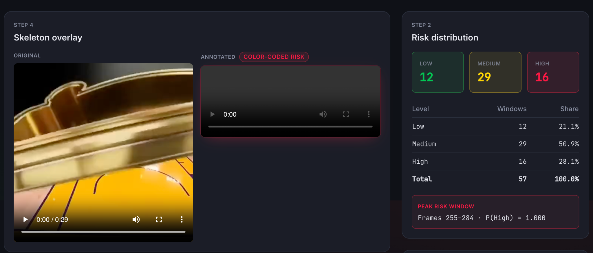
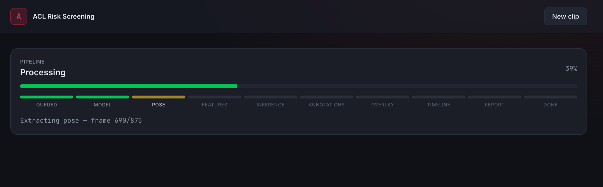
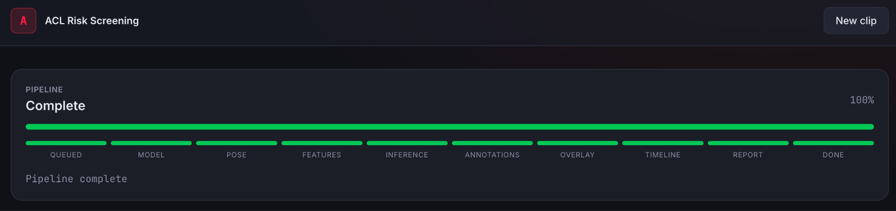
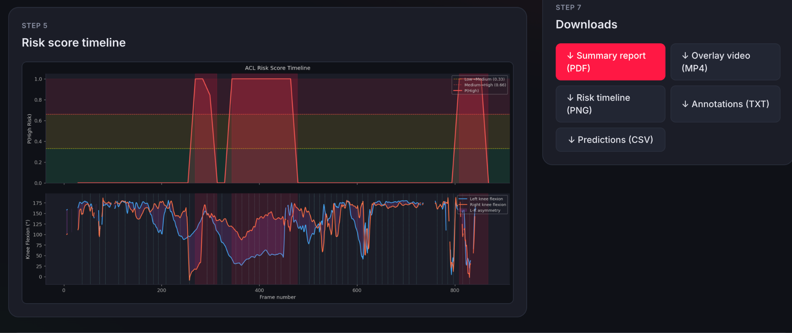
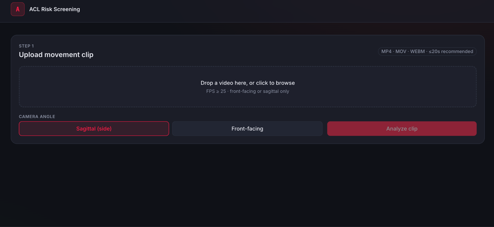

# POISE: Biomechnical Movement Screening from Short Video Clips

This project analyses a video of an athlete moving and tries to predict whether they are at risk of an ACL injury (a common and serious knee ligament injury in sports). You upload a short video clip, and the system processes it through a multi-step pipeline that extracts pose data, runs it through a deep learning model, and gives you back a risk assessment along with a full PDF report.

It uses MediaPipe for pose estimation, a BiLSTM neural network for the actual risk prediction, and FastAPI for the backend API. The frontend is built with React and Vite.

***

## How the pipeline works

When you upload a video, the backend processes it in 8 steps, one after another:

1. **Pose Extraction** - MediaPipe scans each frame of the video and finds the positions of key body joints like knees, hips, ankles, and shoulders
2. **Feature Engineering** - From those joint positions, it calculates angles like the knee flexion angle, hip flexion angle, left-right asymmetry, and trunk lean. A Savitzky-Golay filter is applied to smooth out noisy readings, and velocity is also calculated
3. **Input Validation** - The system checks that enough of the athlete's body is visible in the video and that not too many frames are missing keypoints
4. **BiLSTM Inference** - The extracted features are passed through a sliding window into the BiLSTM model, which predicts the risk level for each window. Results are saved as a CSV file
5. **Frame-level Risk Assignment** - Window-level predictions are mapped back to individual frames. A smoothing pass is applied to remove short false-positive spikes
6. **Skeleton Overlay Video** - A new video is rendered with the skeleton drawn on top and high-risk frames highlighted, so you can see exactly when in the movement the risk occurs
7. **Risk Timeline Chart** - A PNG chart is generated showing how the predicted risk score changes across the duration of the clip
8. **Biomechanical Annotations + PDF Report** - High-risk events get labelled with descriptions, and everything is packed into a downloadable PDF summary report

***

## Tech Stack

**Backend**
- FastAPI + Uvicorn
- MediaPipe (pose landmark detection)
- PyTorch (BiLSTM model)
- OpenCV (video processing)
- NumPy, pandas, SciPy
- ReportLab (PDF generation)

**Frontend**
- React + Vite
- Tailwind CSS

***

## Project Structure

```
Injury-Risk-Prediction/
├── backend/
│   ├── main.py                  # FastAPI app entry point
│   ├── routes.py                # All API endpoints
│   ├── pipeline.py              # Pipeline orchestration and job registry
│   ├── feature_engineering.py  # Pose extraction and biomechanical feature computation
│   ├── inference.py             # BiLSTM model loading and inference
│   ├── overlay.py               # Skeleton overlay video rendering
│   ├── timeline.py              # Risk timeline chart generation
│   ├── annotations.py           # Biomechanical event annotation
│   ├── report.py                # PDF report generation
│   ├── utils.py                 # Helper functions
│   ├── schemas.py               # Pydantic data models
│   └── pose_landmarker.task     # MediaPipe pose model file
├── frontend/
│   ├── src/
│   └── index.html
├── ml/
│   └── preprocessing/
├── data/
├── outputs/                     # Generated outputs per job
├── uploads/                     # Uploaded video files
└── phase-2/ phase-3/ ... phase-6/   # Earlier development phases
```

***

## API Endpoints

| Endpoint | Method | What it does |
|----------|--------|--------------|
| `/api/upload` | POST | Upload a video and start the pipeline. Returns a `job_id` |
| `/api/jobs/{job_id}` | GET | Check the current status and progress of a job |
| `/api/jobs/{job_id}/stream` | GET | Stream live progress updates via Server-Sent Events |
| `/api/jobs/{job_id}/result` | GET | Get the final result JSON once the job is done |
| `/api/jobs/{job_id}/artifacts/{name}` | GET | Download a specific output file (video, chart, CSV, PDF) |
| `/api/healthz` | GET | Check if the server and model are loaded and ready |

### Output artifacts per job

| Filename | Type | Description |
|----------|------|-------------|
| `output_skeleton_overlay.mp4` | Video | Original video with skeleton and risk overlay |
| `risk_timeline.png` | Image | Risk score chart over the duration of the clip |
| `movement_annotations.txt` | Text | Biomechanical notes on high-risk events |
| `per_window_predictions.csv` | CSV | Raw window-level model predictions |
| `summary_report.pdf` | PDF | Full summary report with all findings |

***

## Getting Started

### Prerequisites

- Python >= 3.9
- Node.js >= 18
- pip

### Backend Setup

```bash
cd backend

# Create and activate a virtual environment
python -m venv venv
source venv/bin/activate    # On Windows: venv\Scripts\activate

# Install dependencies
pip install fastapi uvicorn[standard] mediapipe opencv-python torch numpy pandas scipy reportlab

# Start the server
python main.py
```

The API will be running at `http://localhost:8000`

Auto-generated API docs are available at `http://localhost:8000/docs`

### Frontend Setup

```bash
cd frontend

npm install
npm run dev
```

The frontend will be running at `http://localhost:5173`

> **Note:** Start the backend before the frontend. The frontend makes API calls to `localhost:8000` by default.

***

## Video Requirements

The system works best when the following conditions are met:

- Camera angle must be either **front** or **sagittal** (side view). Oblique angles are not supported because they mess up the 2D joint angle calculations
- The athlete should be fully visible in the frame throughout the clip
- Supported formats: `.mp4`, `.mov`, `.avi`, `.mkv`, `.webm`

If more than 25% of frames have missing keypoints, the pipeline will reject the video and ask you to re-record.

***

## Model and Features

The BiLSTM model takes a sliding window of frames as input. For each frame, 8 features are computed:

- Left and right knee flexion angle
- Left and right hip flexion angle
- Left-right knee asymmetry
- Trunk lean angle
- Left and right knee angular velocity (rate of change of the knee angle)

These features are extracted using MediaPipe's pose landmarker model (`pose_landmarker.task`), which is already included in the backend folder.

***

## Notes

- The trained BiLSTM model weights need to be placed in `backend/models/`. They are not included in the repo due to file size. You will need to train the model separately or get the weights from the project team.
- The `phase-2` through `phase-6` folders contain earlier versions of the pipeline kept for reference.
- Jobs are stored in memory, so they will be cleared when the server restarts.

***

### Pipeline in Action

**Step 1–2 · Pose Extraction & Feature Engineering**



**Step 6 · Skeleton Overlay Video (rendered frame)**





**Step 7 · Risk Timeline Chart**



**Frontend · Upload & Results Page**



***

## License

MIT

***

*Built as a capstone project exploring computer vision and deep learning for non contact injury prevention.*